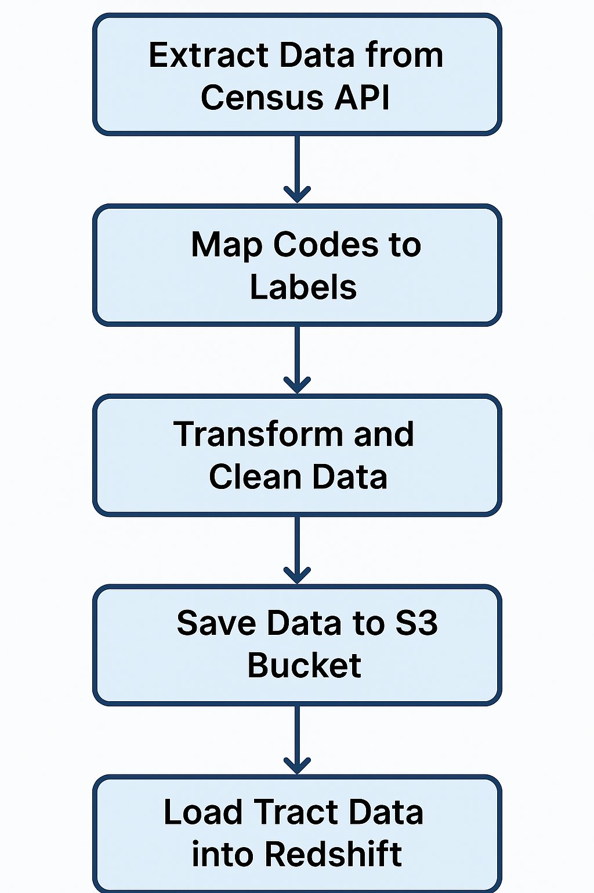

# Clean Census ACS Data Pipeline

This project includes automated ETL pipelines to pull, map, clean, and load U.S. Census ACS 5-Year Demographic Profile and Subject data.

## Features
- Pulls Census data using the official API
- Maps codes to human-readable labels using an Excel config
- Uploads processed data to AWS S3
- Loads data into AWS Redshift with schema-specific structure
- Supports ZIP Code Tabulation Area (ZCTA) and Census Tract levels

## Files
- `test_final_zcta.py` – ZCTA-level ETL script (2017 datasets)
- `Test_census_tract.py` – Tract-level ETL pipeline (2023 datasets with retry and SQLite API usage tracking)
- `Census Data Fields for API.xlsx` – Column renaming and mapping configuration

## 📊 Visual Examples

### Census Tract Sample Output

### ZCTA Sample Output

### Table Metadata Example

### ZCTA Pipeline Flowchart

### Census Tract Pipeline Flowchart

## Author
Nisaharan Genhatharan

